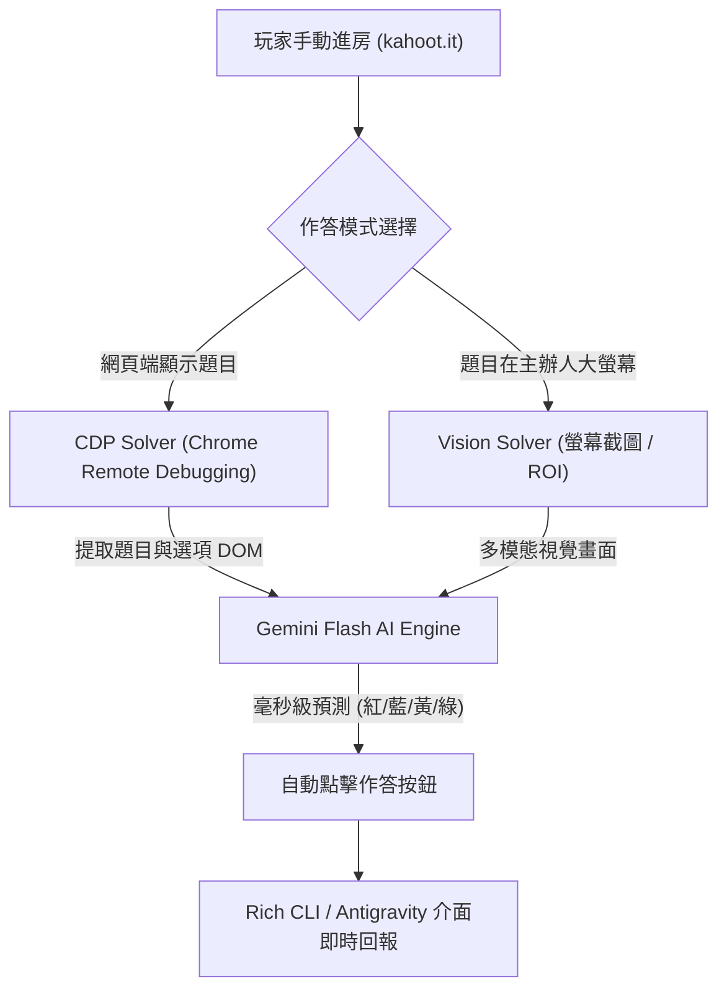

# 🎯 Kahoot AI Agent (`kahoo-agent`)

> 高效能、雙模式的 Kahoot 即時 AI 答題代理人。支援 **CDP 瀏覽器直連接管** 與 **多模態螢幕視覺識別**，結合 Google Gemini 實現毫秒級超神速作答，並原生相容 **Antigravity Agent Skill**。

---

## 🌟 特色功能

- ⚡ **毫秒級超速作答**：採用 Google Gemini 2.5 Flash / Flash Lite，輸出字元壓縮到極限，延遲僅約 0.3 ~ 0.8 秒。
- 🎮 **CDP 瀏覽器接管模式 (推薦)**：
  - 你自己手動進房，程式透過 Chrome DevTools Protocol (9222 port) 零侵入附著現有視窗。
  - 適用於「玩家裝置上顯示題目與選項」模式，精準讀取 DOM 並自動點擊四色幾何按鈕。
- 👁️ **多模態螢幕視覺模式 (Vision Mode)**：
  - 適用於傳統課堂「題目只投在大螢幕或 Zoom / Teams 會議共享」的場景。
  - 即時截取主辦人投影片畫面，送交多模態模型辨識題意，自動定位並點擊玩家視窗按鈕。
- 📊 **Rich 終端儀表板**：即時彩色印出當前題目、AI 推論選項、信心度、反應耗時與累積得分。
- 🤖 **Antigravity 原生整合**：內建 Skill 封裝，只要在 Antigravity 視窗打「幫我玩 Kahoot」，AI 自動派發代理執行。

---

## 🏗️ 系統架構



---

## 🚀 快速開始

### 1. 安裝環境依賴

建議使用 Python 3.10+ 環境：

```bash
git clone https://github.com/D1349375/kahoo-agent.git
cd kahoo-agent
pip install -r requirements.txt
playwright install chromium
```

### 2. 設定 API Key

複製 `.env.example` 為 `.env` 並填入您的 Gemini API 金鑰：

```bash
cp .env.example .env
```

```env
GEMINI_API_KEY="your_actual_gemini_api_key"
```

---

## 🕹️ 使用指南

### 模式 A：CDP 瀏覽器接管模式（最推薦）

1. **啟動遠端除錯 Chrome 視窗**：
   
   **Windows (PowerShell)**:
   ```powershell
   & "C:\Program Files\Google\Chrome\Application\chrome.exe" --remote-debugging-port=9222 --user-data-dir="C:\tmp\kahoot_profile"
   ```

2. **手動進房**：
   在開啟的 Chrome 視窗中進入 `https://kahoot.it`，輸入 Game PIN 與暱稱進入大廳。

3. **啟動 Agent**：
   ```bash
   python main.py cdp
   ```
   程式會自動找到該 Kahoot 標籤頁，待題目倒數一出，瞬間完成答題！

---

### 模式 B：螢幕視覺辨識模式（題目在投影幕/會議共享）

若題目只在主辦人的共享畫面上：

```bash
python main.py vision --roi 100,100,800,600
```
*(如果不帶 `--roi` 參數，則會全螢幕監看)*

---

### 模式 C：在 Antigravity 中直接使用

將專案目錄下的 `skill/` 複製或掛載到 `~/.gemini/config/skills/kahoot-pilot/`，隨後即可在 Antigravity 聊天介面直接輸入：

> **「我已經進 Kahoot 房間了，幫我接管開始作答」**

---

## ⚙️ 進階配置 (`config.yaml`)

可參考 `config.example.yaml` 進行細部調整：
- `gameplay.answer_delay_sec`: 作答前故意延遲秒數（模擬真人作答，預設 0.4s）。
- `gameplay.mode`: `auto`（全自動點擊）或 `assist`（僅在終端提示答案，由您手動點擊）。

---

## ⚖️ 免責聲明 (Disclaimer)

本專案僅供程式語言研究、自動化測試（Web Automation）及多模態 AI 即時推理之技術交流與學術教學用途。請勿於正式考試、具利益競爭或違反 Kahoot 服務條款之場合使用。
